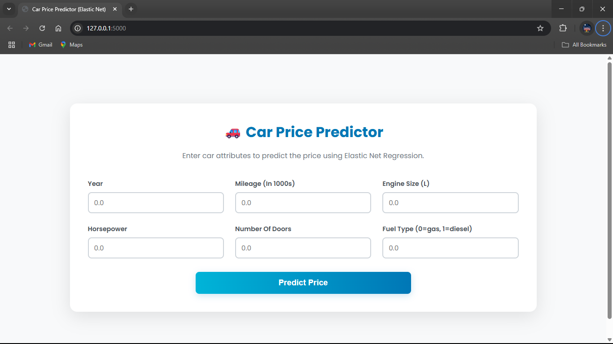
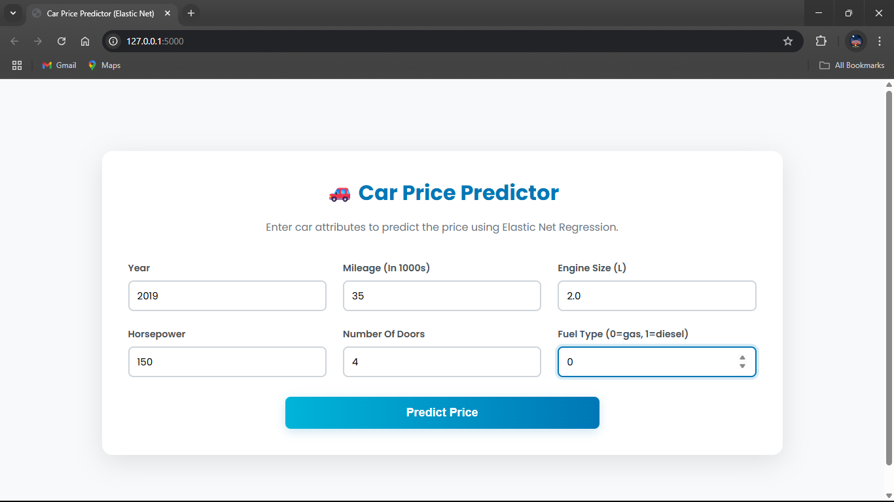
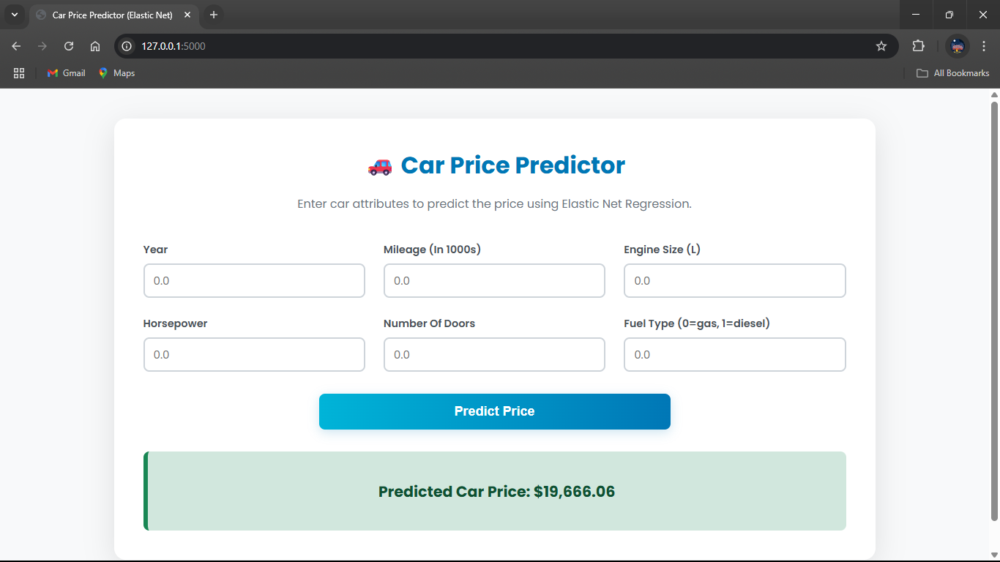

-----

# Car Price Prediction with ElasticNet Regression

This project predicts the price of used cars based on various features using an **ElasticNet regression model**. The trained model is deployed as a simple web application using Flask, allowing users to get price predictions in real-time. 🚗

-----

## Overview

The main goal of this project is to build a reliable machine learning model that can accurately estimate the market price of a used car. The process involves:

1.  **Exploratory Data Analysis (EDA)**: Understanding the dataset, visualizing relationships between features, and preparing the data for modeling.
2.  **Feature Engineering**: Transforming categorical features into a numerical format suitable for a regression model.
3.  **Model Training**: Building and training an ElasticNet regression model, which is effective for datasets with many features or multicollinearity.
4.  **Model Serialization**: Saving the trained model into a `pickle` file for later use.
5.  **Web Application**: Creating a simple web interface with **Flask** where a user can input car details and receive a price prediction.

-----

## The Model: Why ElasticNet?

**ElasticNet Regression** is a linear regression model that combines the penalties of both Lasso (L1) and Ridge (L2) regression methods.

  * **Lasso (L1)** helps in feature selection by shrinking the coefficients of less important features to zero.
  * **Ridge (L2)** helps to handle multicollinearity (when features are highly correlated) by shrinking coefficients.

By combining both, ElasticNet gets the best of both worlds, making it a robust choice for datasets like car price prediction where many features might be correlated or irrelevant.

-----

## File Structure

The repository is organized as follows:

  * `Car Price ElasticNet App.ipynb`: A Jupyter Notebook containing the complete data analysis, feature engineering, model training, and evaluation steps.
  * `Car_Price_Assignment.csv`: The raw dataset containing features and prices of various cars.
  * `app.py`: The **Flask application** script. It loads the trained model and serves the HTML interface.
  * `car_price_elasticnet_app.pkl`: The serialized (saved) trained ElasticNet model file.
  * `requirements.txt`: A list of all Python libraries required to run the project.

-----

## How to Run the Project

To get the project up and running on your local machine, follow these steps.

### 1\. Clone the Repository

```bash
git clone https://github.com/SURESH6161/Data-Science.git
cd Data-Science/Supervised/Car_Price_ElasticNet_App
```

### 2\. Create a Virtual Environment (Recommended)

It's a best practice to create a virtual environment to keep project dependencies isolated.

```bash
# For Windows
python -m venv venv
venv\Scripts\activate

# For macOS/Linux
python3 -m venv venv
source venv/bin/activate
```

### 3\. Install Dependencies

Install all the required libraries listed in `requirements.txt`.

```bash
pip install -r requirements.txt
```

### 4\. Run the Flask App

Execute the `app.py` script to start the local web server.

```bash
python app.py
```

### 5\. Access the Application

Open your web browser and navigate to the following address:
[http://127.0.0.1:5000](https://www.google.com/search?q=http://127.0.0.1:5000)

You should see a web form where you can input car details to get a price prediction.




