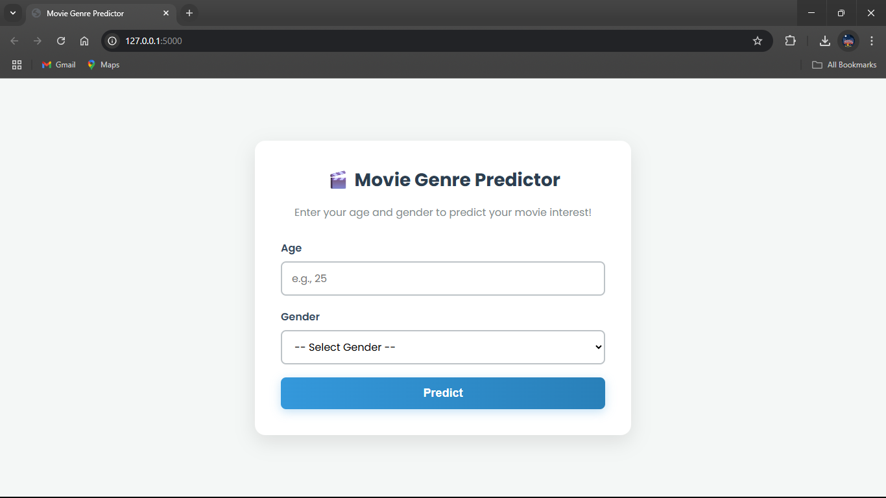
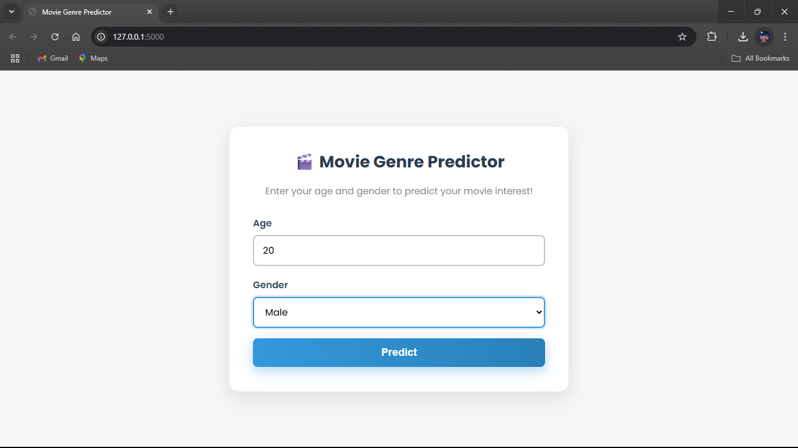
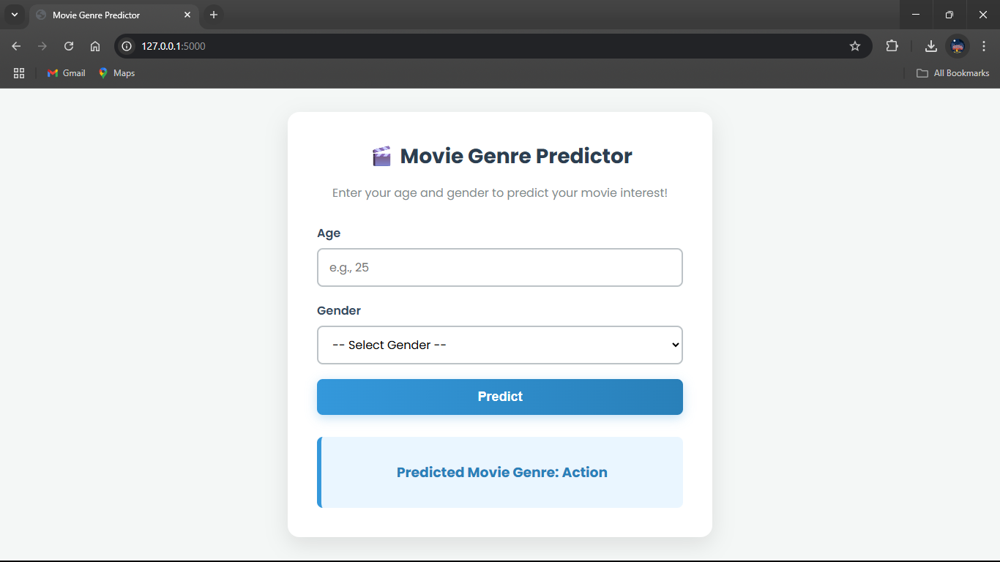

# Decision Tree Movie Interest Predictor

-----

## Description

The goal of this project is to build a simple machine learning model that can predict whether a person will like a particular movie genre based on their demographic information. A decision tree algorithm is used for this classification task. This project serves as a good introduction to building and visualizing decision tree models.

### The Goal: A Smart Guessing Game

Imagine you're trying to guess what kind of movie a person likes. You'd probably ask some questions, right? "How old are you?" "Are you male or female?" Based on the answers, you'd make an educated guess. A **Decision Tree** does the exact same thing. It learns a set of "if-then" rules from the data you provide to make the best possible guesses.

### The Algorithm: The Decision Tree

A decision tree is a flowchart-like structure. Here’s how it works:

1.  **Root Node**: It starts with a single question about the most important feature. For example, it might ask, "Is the person's age less than 25?"
2.  **Branches**: Each answer to the question leads down a different path or "branch."
3.  **Internal Nodes & Leaf Nodes**: The branches lead to more questions (internal nodes) until a final conclusion is reached. The endpoint of a branch, which gives the final prediction (e.g., "Action" or "Drama"), is called a **leaf node**.

The tree automatically figures out the best questions to ask and in what order to most accurately split the data.

## Dataset

The dataset used for this project is `movie preference.csv`. It contains the following columns:

  * **age**: Age of the person.
  * **gender**: Gender of the person (e.g., Male, Female).
  * **genre**: The movie genre preference (e.g., Action, Comedy, Drama).

## Dependencies

The project is implemented in a Jupyter Notebook (`.ipynb`) and requires the following Python libraries:

  * `pandas`
  * `scikit-learn`
  * `graphviz`
  * `pydotplus`

You can install the necessary libraries using `pip`:

```bash
pip install pandas scikit-learn graphviz pydotplus
```

## Usage

1.  Clone the repository:
    ```bash
    git clone https://github.com/SURESH6161/Data-Science.git
    ```
2.  Navigate to the project directory:
    ```bash
    cd Data-Science/Supervised/Decision_tree_Movie_Interest_Predictor
    ```
3.  Open the Jupyter Notebook `Decision tree Movie Interest Predictor.ipynb` and run the cells.

## The Code & Results: Bringing the Model to Life

-----

The code in the Jupyter notebook builds the model using the `scikit-learn` library.

First, the data is split into a **training set** and a **testing set**. The model learns patterns from the training set (like a student studying practice problems). Then, its performance is evaluated on the testing set, which it has never seen before (like a final exam).

The model is trained using the `model.fit()` command, which builds the internal flowchart of rules.

Finally, the trained decision tree can be visualized to understand how it makes predictions. This visualization is incredibly powerful because it makes the model transparent. You can see exactly why it predicted "Action" for a 22-year-old male, for example, making the results easy to understand and explain.



