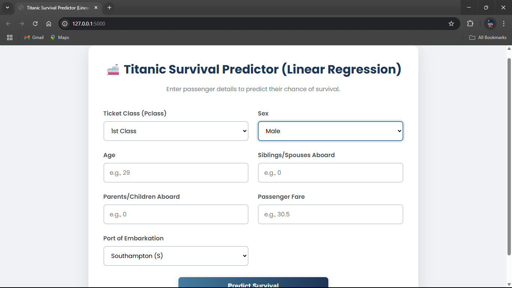
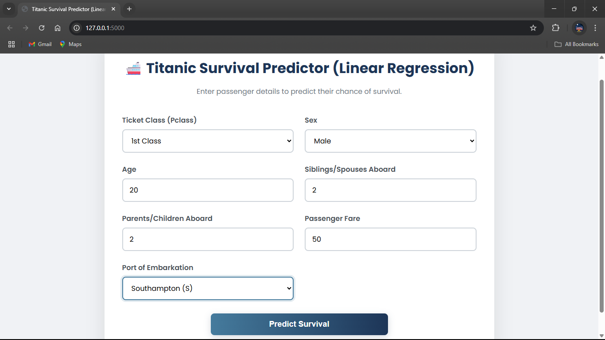
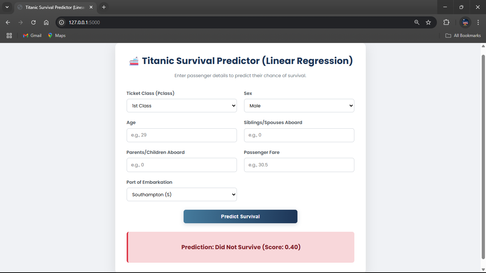

-----

### Objective: Predicting Survival 🚢

The goal is to use the historical passenger data from the Titanic to build a machine learning model that can predict whether a given passenger would have survived the shipwreck. This is a classic classification problem: the answer is a "yes" or "no" (or 1 or 0).

-----

### Phase 1: Exploratory Data Analysis (EDA) - Learning from the Data

Before building a model, a data scientist must first understand the data. This is like being a detective looking for clues. The notebook explores the `titanic.csv` file to answer key questions.

  * **Clue 1: Did Wealth Matter?**
    The `Pclass` (Passenger Class) feature is a proxy for wealth. The analysis shows a strong correlation:

      * **1st Class passengers** had a much higher survival rate (over 60%).
      * **3rd Class passengers** had a very low survival rate (under 25%).
        This tells us that social status was a major factor.

  * **Clue 2: Were Women and Children First?**
    The data confirms this historical anecdote.

      * **Females** had a survival rate of over 70%.
      * **Males** had a survival rate of less than 20%.
        Similarly, **children** had a higher chance of survival than adults.

-----

### Phase 2: Data Preprocessing - Cleaning and Preparing the "Ingredients"

A machine learning model can't work with raw, messy data. It needs clean, numerical inputs.

  * **Handling Missing Values:** The `Age` column has many missing entries. A common strategy, likely used in the notebook, is **imputation**: filling the missing spots with the average age of all passengers. This prevents us from having to delete those rows entirely.

  * **Converting Text to Numbers:** Models only understand numbers. Therefore, categorical features must be converted:

      * `Sex`: 'male' and 'female' are converted to `0` and `1`.
      * `Embarked`: 'S', 'C', and 'Q' are also converted into numerical values. This process is called **label encoding** or **one-hot encoding**.

-----

### Phase 3: Building the Model with Logistic Regression

Once the data is clean and numerical, it's ready for modeling.

**Why Logistic Regression?**
This is a classification task, and **Logistic Regression** is the perfect tool because it calculates the **probability** of an outcome.

**How It Works (Simplified):**

1.  The model takes all the numerical features (Age, Sex, Pclass, Fare, etc.) as inputs.
2.  It learns a mathematical formula from the training data, assigning a "weight" or importance to each feature.
3.  When given a new passenger's data, it plugs those values into the formula and outputs a probability score between 0 and 1. If the score is **\> 0.5**, the model predicts **"Survived" (1)**. If it's **\< 0.5**, it predicts **"Died" (0)**.

-----

### Phase 4: Evaluating the Model - How Good Are Our Predictions?

After training the model, the final step is to test its performance on data it has never seen before. The most common metric is **Accuracy**, which is the percentage of passengers for whom the model made the correct prediction. For example, an accuracy of 82% means the model correctly predicted the fate of 82 out of every 100 passengers in the test set.

-----

## How to Run the Project

To run the analysis on your own machine, you'll need Python and a few common data science libraries. Follow these steps.

### Step 1: Clone the Repository

First, get the project files onto your computer using Git.

```bash
git clone https://github.com/SURESH6161/Data-Science.git
cd Data-Science/Supervised/LinearRegression_Titanic_Survival_Predictor
```

### Step 2: Create a Virtual Environment (Recommended)

This creates an isolated environment for the project's dependencies, which is a professional best practice.

  * **For Windows:**
    ```bash
    python -m venv venv
    venv\Scripts\activate
    ```
  * **For macOS/Linux:**
    ```bash
    python3 -m venv venv
    source venv/bin/activate
    ```

### Step 3: Install Dependencies

Install the necessary libraries using `pip`.

```bash
pip install pandas numpy scikit-learn matplotlib seaborn jupyterlab
```

### Step 4: Launch JupyterLab

Start the Jupyter environment to interact with the notebook.

```bash
jupyter lab
```

This command will open a new tab in your web browser. From there, you can navigate to and click on the `LinearRegression Titanic Survival Predictor.ipynb` file to open it and run the cells.




