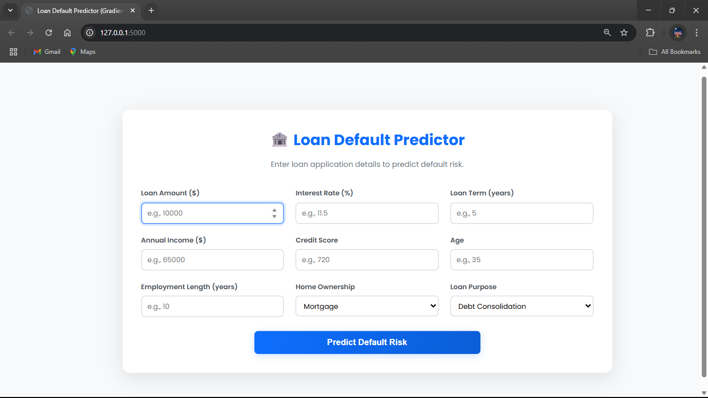
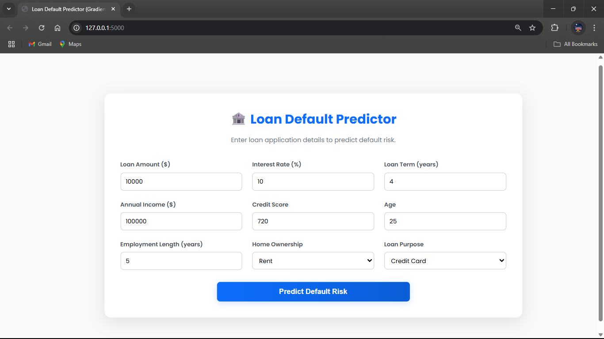
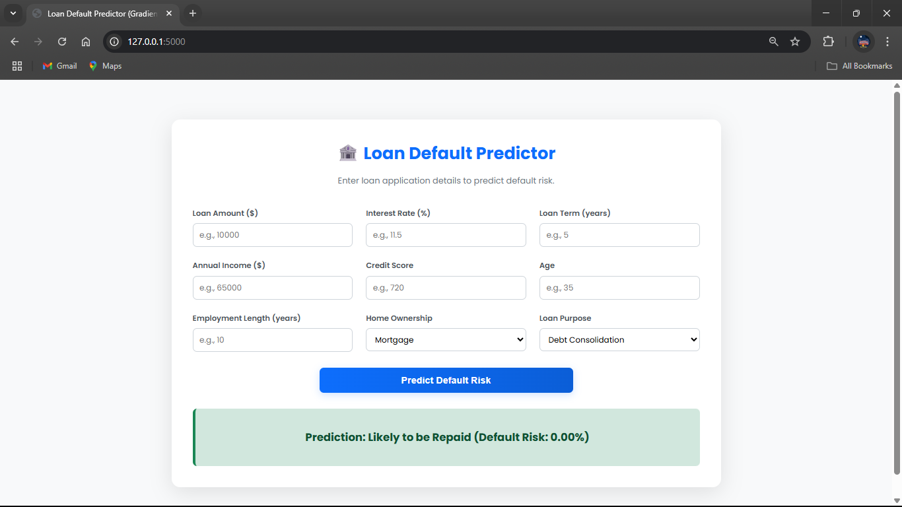

-----

# Loan Default Prediction Web App

This project is a web application that predicts the likelihood of a loan default based on user-input financial data. The prediction is made using a pre-trained Gradient Boosting model. The application is built with Flask, a Python web framework.

## Introduction

The goal of this project is to provide a simple and intuitive interface for users to get a loan default prediction. The user enters information such as their age, income, loan amount, and credit score. The application then uses a trained machine learning model to predict whether the person is likely to default on their loan.

## Files Description

The repository contains the following files:

  * **app.py**: This is the main file that runs the Flask web application. It handles the routing, receives user input from the web form, processes the data, and uses the trained model to make a prediction. The result is then displayed on the web page.
  * **model.pkl**: This file contains the pre-trained Gradient Boosting classifier model. The model has been trained on a dataset of historical loan data to learn the patterns that indicate a high risk of default.
  * **preprocessor.pkl**: This file contains the pre-trained data preprocessor. The preprocessor is used to scale and transform the user input data into the same format that was used to train the model. This is a crucial step to ensure that the model makes accurate predictions.
  * **templates/index.html**: This is the HTML template for the web application's user interface. It contains the form where users can input their financial information.
  * **static/style.css**: This file contains the CSS code for styling the web application. It is used to customize the appearance of the web page, including the layout, colors, and fonts.

## 🚀 How to Run the Project

Follow these steps to get the application running on your local machine.

### 1\. Prerequisites

Make sure you have **Python 3** and **pip** installed on your system.

### 2\. Clone the Repository

First, clone the specific project folder from the repository. Since you can't clone a sub-directory directly with git, you can download it or use a third-party tool like `svn`.

**Option A: Download the ZIP**

1.  Navigate to the main repository page.
2.  Click `Code` -\> `Download ZIP`.
3.  Unzip the file and navigate to the `Supervised/Loan_Default_GB_App` directory in your terminal.

**Option B: Use `svn` (if you have it installed)**

```bash
# Export the specific directory
svn export https://github.com/SURESH6161/Data-Science/trunk/Supervised/Loan_Default_GB_App

# Navigate into the new directory
cd Loan_Default_GB_App
```

### 3\. Create a Virtual Environment

It's a best practice to create a virtual environment to manage project dependencies separately.

```bash
# Create the virtual environment
python -m venv venv

# Activate the environment
# On Windows:
venv\Scripts\activate

# On macOS/Linux:
source venv/bin/activate
```

You'll know it's active when you see `(venv)` at the beginning of your command prompt.

### 4\. Install Dependencies

The required Python libraries are listed in a `requirements.txt` file. Create this file inside your project directory and add the following content:

**`requirements.txt`**:

```
Flask
scikit-learn
pandas
numpy
```

Now, install them all with a single command:

```bash
pip install -r requirements.txt
```

### 5\. Run the Application

With the setup complete, you can now start the Flask web server.

```bash
python app.py
```

You should see an output indicating that the server is running, usually on `http://127.0.0.1:5000`.

### 6\. View in Browser

Open your web browser and navigate to the following address:

**[http://127.0.0.1:5000](https://www.google.com/url?sa=E&source=gmail&q=http://127.0.0.1:5000)**

You should now see the loan prediction web application. You can fill out the form and submit it to get a prediction.

-----

## 🖼️ Screenshot



