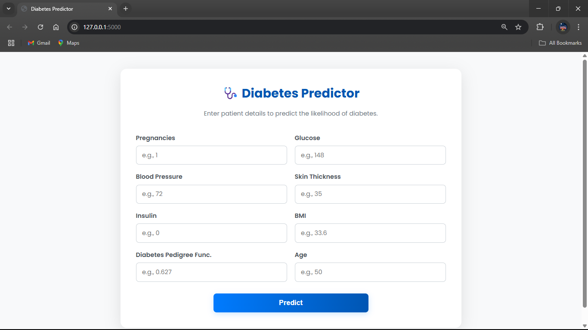
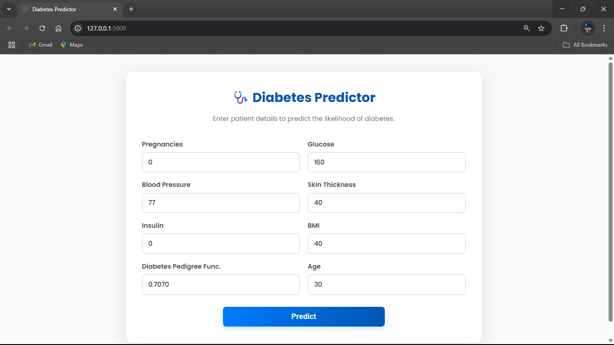
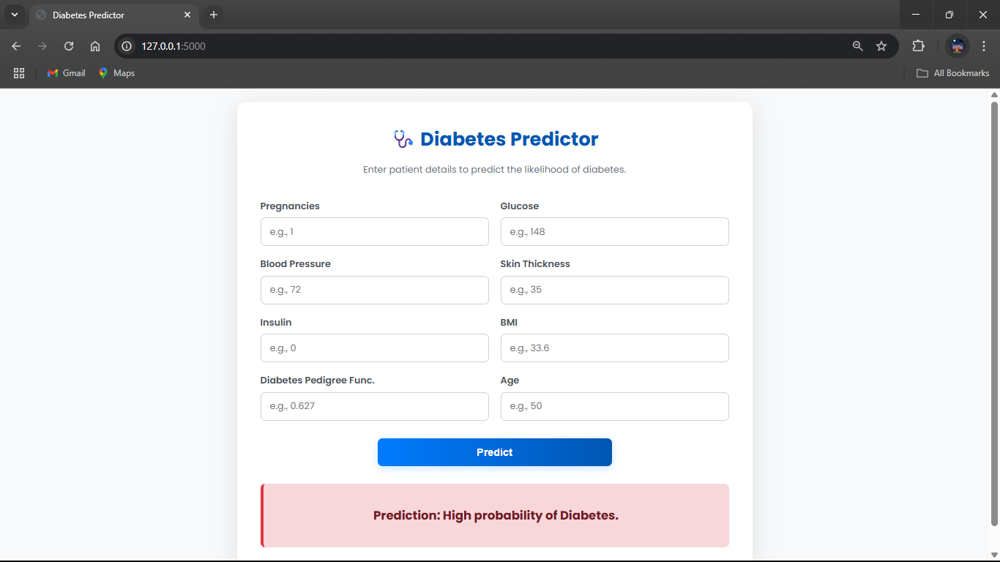

# Check the Live Page  https://logistic-alogrithm-heart-disease-find.onrender.com/ 
-----

# Diabetes Predictor using Logistic Regression 🩺

This project uses a **Logistic Regression** model to predict whether a patient has diabetes based on certain diagnostic medical measurements. The entire data analysis and model building process is contained within a Jupyter Notebook.

-----

## 📄 Files Description

  * **`LogisticRegression_Diabetes_Predictor.ipynb`**: This is the core of the project. It's a Jupyter Notebook that contains all the Python code for:
      * Loading and exploring the dataset.
      * Visualizing the data to find trends.
      * Preprocessing the data for modeling.
      * Training a Logistic Regression classifier.
      * Evaluating the model's performance.
  * **`diabetes.csv`**: This is the dataset used for the project. It contains several medical predictor variables and one target variable, `Outcome`.

-----

## 🚀 How to Run the Project

Follow these instructions to explore the project and run the code on your local machine.

### 1\. Prerequisites

Ensure you have the following installed on your system:

  * **Python 3**
  * **pip** (Python's package installer)
  * **Jupyter Notebook**

If you don't have Jupyter, you can install it with pip:

```bash
pip install notebook
```

### 2\. Get the Project Files

You need to get the project files onto your machine.

**Option A: Download the Folder**

1.  Navigate to the main repository on GitHub.
2.  Click the green `Code` button and select `Download ZIP`.
3.  Unzip the downloaded file.
4.  In your terminal or file explorer, navigate to the `Supervised/LogistcRegression_Diabetes_Predictor` directory.

**Option B: Use `svn` (if you have it)**
If you have `svn` (a version control tool) installed, you can download just this specific folder.

```bash
# Export the specific directory
svn export https://github.com/SURESH6161/Data-Science/trunk/Supervised/LogistcRegression_Diabetes_Predictor

# Navigate into the new directory
cd LogistcRegression_Diabetes_Predictor
```

### 3\. Create a Virtual Environment (Recommended)

Using a virtual environment keeps your project's dependencies isolated.

```bash
# Create the virtual environment
python -m venv venv

# Activate the environment
# On Windows:
venv\Scripts\activate

# On macOS/Linux:
source venv/bin/activate
```

### 4\. Install Required Libraries

Create a file named `requirements.txt` in the project directory and add the following lines:

**`requirements.txt`**:

```
pandas
numpy
scikit-learn
matplotlib
seaborn
notebook
```

Now, install all the libraries at once using pip:

```bash
pip install -r requirements.txt
```

### 5\. Launch Jupyter Notebook

With all the dependencies installed, you can now launch Jupyter.

```bash
jupyter notebook
```

This command will start the Jupyter server and open a new tab in your web browser showing the file directory.

### 6\. Run the Notebook

In the browser tab that just opened, click on the **`LogisticRegression_Diabetes_Predictor.ipynb`** file. This will open the notebook, and you can run the code cells individually to see the analysis and model-building process step-by-step.

-----

## 🖼️ Screenshot





## Disclaimer

This project is for educational and demonstrative purposes only. The model and application should not be used for real-world financial systems without extensive further testing, validation, and adherence to security best practices.
