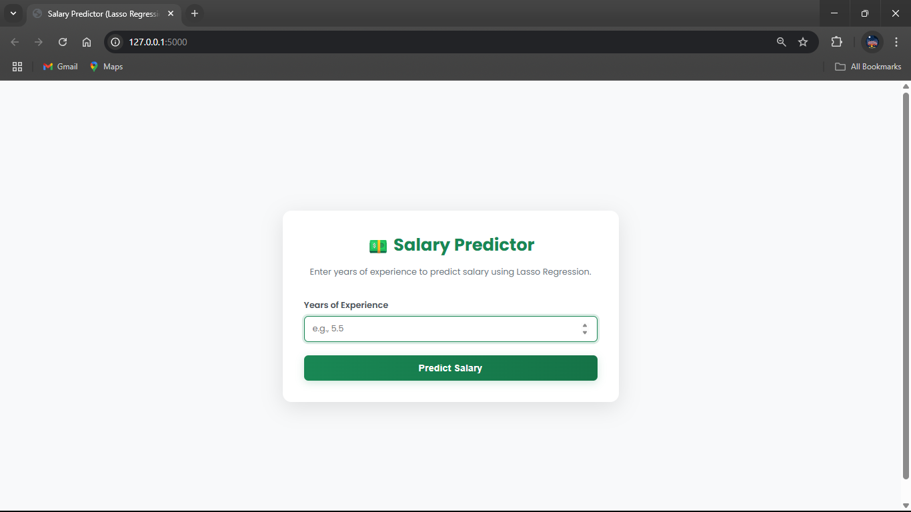
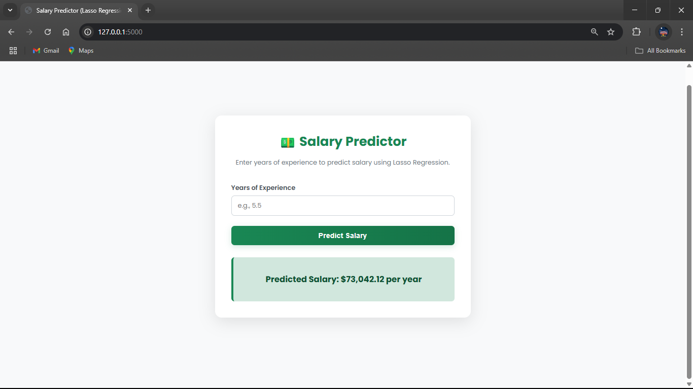

-----

# Data Professional Salary Predictor 💼

This project is a web application that predicts the salary of a data professional based on various factors like job title, years of experience, and company rating. The prediction model is built using **Lasso Regression**, a linear model that performs feature selection to prevent overfitting.

The entire project, from data cleaning and model training to deployment, is included. The final product is a simple web app built with **Flask**.

-----

## 📄 Files Description

  * **`Salary Predictor.ipynb`**: This Jupyter Notebook contains the complete data science workflow. It covers data loading, extensive cleaning, exploratory data analysis (EDA), feature engineering, and the training and evaluation of the Lasso Regression model.
  * **`app.py`**: The core Flask application. It loads the pre-trained Lasso model, manages the web routes, and processes user input to return a salary prediction.
  * **`model.pkl`**: The serialized, pre-trained Lasso Regression model file. This is the "brain" of the application.
  * **`Salary Prediction of Data Professions.csv`**: The raw dataset containing salary information and job characteristics for various data professions.
  * **`templates/home.html`**: The HTML template that creates the user interface, including the input form for users to enter job details.
  * **`static/style.css`**: The CSS file used to style the web application's front-end for a better user experience.

-----

## 🚀 How to Run the Project

You can either interact with the final web application or dive into the code by exploring the Jupyter Notebook.

### Part A: Running the Flask Web App

Follow these steps to get the salary predictor application running locally.

#### 1\. Get the Project Files

You need to download the project folder to your machine. Using `svn` is a quick way to get just the specific folder.

```bash
# Export the specific project directory
svn export https://github.com/SURESH6161/Data-Science/trunk/Supervised/Salary_Predictor_Lasso_App

# Navigate into the new directory
cd Salary_Predictor_Lasso_App
```

*(Alternatively, you can download the entire repository as a ZIP from GitHub and navigate to this folder).*

#### 2\. Create a Virtual Environment

It's best practice to use a virtual environment to manage dependencies.

```bash
# Create the environment
python -m venv venv

# Activate it
# On Windows:
venv\Scripts\activate

# On macOS/Linux:
source venv/bin/activate
```

#### 3\. Install Dependencies

Create a file named `requirements.txt` in the project directory and add the following libraries:

**`requirements.txt`**:

```
Flask
scikit-learn
pandas
numpy
```

Now, install them all using pip:

```bash
pip install -r requirements.txt
```

#### 4\. Run the Application

Start the Flask web server by running the `app.py` script.

```bash
python app.py
```

#### 5\. View in Browser

Open your favorite web browser and go to the following URL:

**[http://127.0.0.1:5000](https://www.google.com/search?q=http://127.0.0.1:5000)**

You can now input different job parameters to get a salary prediction.

-----

### Part B: Exploring the Jupyter Notebook

To understand how the model was built, you can run the notebook.

1.  **Install Jupyter:** If you haven't already, add `notebook` to your `requirements.txt` file and run `pip install -r requirements.txt`.
2.  **Launch Jupyter:** From your terminal (with the virtual environment active), run the command:
    ```bash
    jupyter notebook
    ```
3.  **Open the Notebook:** A browser tab will open. Click on **`Salary Predictor.ipynb`** to view the code, visualizations, and analysis.

-----

## 🖼️ Screenshot




-----

## ⚖️ Disclaimer

This project was created for educational and portfolio purposes. The predictions are based on the patterns in the training dataset and should be considered estimates, not guaranteed salary figures. The model's accuracy is limited by the scope and quality of the data used.