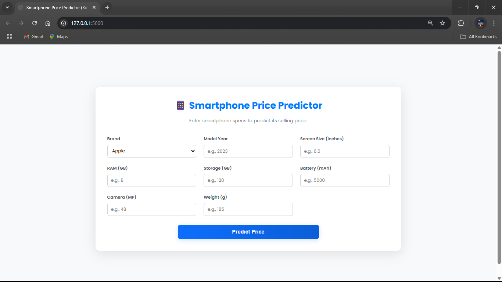
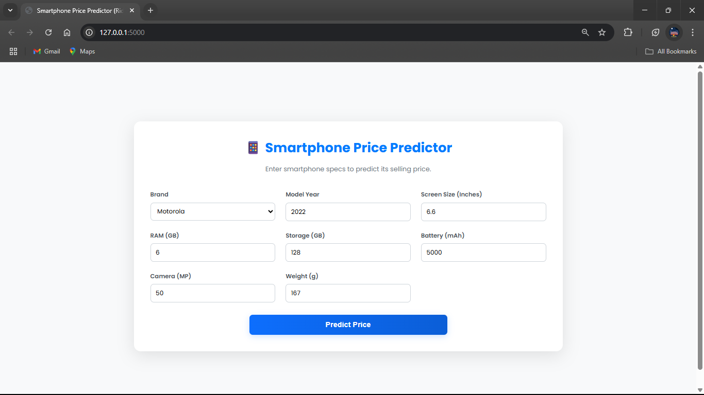
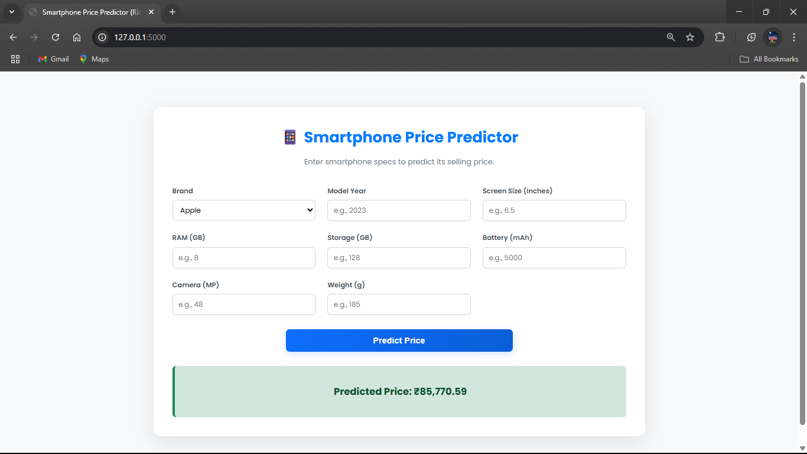

Of course. Here is a detailed README.md for the Smartphone Price Predictor application.

# Smartphone Price Predictor using Ridge Regression 📱

This project is a web application that predicts the price of a smartphone based on its technical specifications like RAM, storage, camera resolution, and screen size. The prediction model is built using **Ridge Regression**, a powerful linear algorithm that is effective when features are highly correlated.

The final model is deployed as a user-friendly web application using the **Flask** framework.

-----

## 📄 Files Description

  * **`Smartphone Price Prediction.ipynb`**: This Jupyter Notebook documents the entire data science process. It includes loading the dataset, data cleaning, exploratory data analysis (EDA), feature engineering, and the training and evaluation of the Ridge Regression model.
  * **`app.py`**: The Flask application script. It loads the pre-trained model and preprocessor, handles the web interface, and processes user input to deliver a price prediction.
  * **`model.pkl`**: The serialized, pre-trained Ridge Regression model file.
  * **`preprocessor.pkl`**: A serialized data preprocessor object (likely a `ColumnTransformer` from scikit-learn). This is a critical component that transforms the raw user input (both numerical and categorical) into the correct format that the model expects.
  * **`smartphones.csv`**: The dataset containing the specifications and prices of various smartphones used to train the model.
  * **`templates/index.html`**: The HTML file that creates the front-end user interface, including the form for inputting smartphone specs.

-----

## 🚀 How to Run the Project

You can run the final web application directly or explore the model creation process in the Jupyter Notebook.

### Part A: Running the Flask Web App

Follow these steps to run the price predictor application on your machine.

#### 1\. Get the Project Files

Download the project folder to your computer. A quick method is to use `svn` if you have it installed.

```bash
# Export just this specific project folder
svn export https://github.com/SURESH6161/Data-Science/trunk/Supervised/Smartphone_Price_Ridge_App

# Navigate into the new directory
cd Smartphone_Price_Ridge_App
```

*(Alternatively, you can download the entire repository as a ZIP from GitHub and navigate to this folder).*

#### 2\. Create a Virtual Environment

Isolating your project's dependencies in a virtual environment is highly recommended.

```bash
# Create the environment
python -m venv venv

# Activate it
# On Windows:
venv\Scripts\activate

# On macOS/Linux:
source venv/bin/activate
```

#### 3\. Install Dependencies

Create a file named `requirements.txt` in the project directory with the following content:

**`requirements.txt`**:

```
Flask
scikit-learn
pandas
numpy
```

Now, install all the required libraries at once:

```bash
pip install -r requirements.txt
```

#### 4\. Run the Application

Start the Flask server by executing the `app.py` script.

```bash
python app.py
```

#### 5\. View in Browser

Open your web browser and navigate to the following URL:

**[http://127.0.0.1:5000](https://www.google.com/search?q=http://127.0.0.1:5000)**

You can now input different smartphone specifications to get a price prediction.

-----

### Part B: Exploring the Jupyter Notebook

To see how the model was built and the data was analyzed, you can run the notebook.

1.  **Install Jupyter:** If you don't have it, add `notebook` to your `requirements.txt` file and run `pip install -r requirements.txt` again.
2.  **Launch Jupyter:** In your terminal (with the virtual environment active), run the command:
    ```bash
    jupyter notebook
    ```
3.  **Open the Notebook:** In the browser tab that opens, click on **`Smartphone Price Prediction.ipynb`** to view the complete workflow.

-----

## 🖼️ Screenshot




-----

## ⚖️ Disclaimer

This project is intended for educational and demonstration purposes. The predicted prices are estimates based on the patterns found in the dataset and should not be considered exact market values. The model's accuracy is limited by the data it was trained on.