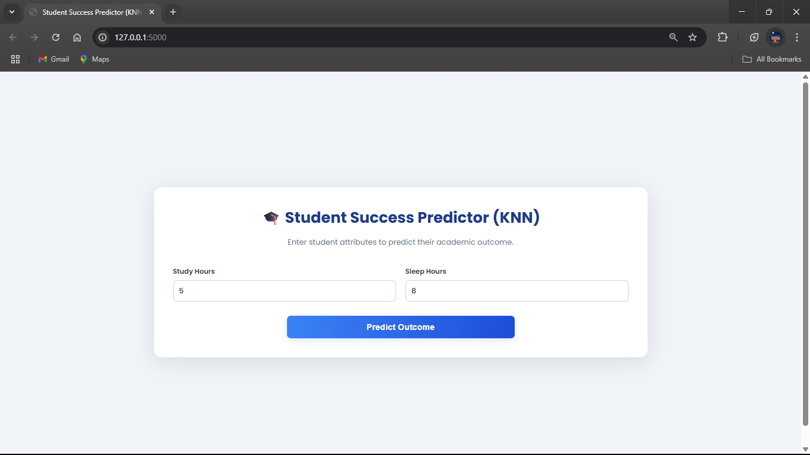
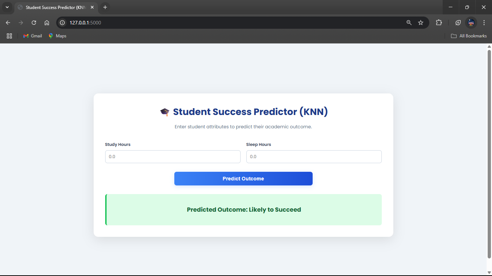

# Student Success Predictor using K-Nearest Neighbors (KNN) 🎓

This project predicts a student's academic outcome—whether they are likely to **Graduate**, **Drop out**, or remain **Enrolled**. The prediction is made using a **K-Nearest Neighbors (KNN)** classifier, which is trained on a dataset of student demographic, social, and academic data.

The final model is deployed as an interactive web application using **Flask**, allowing users to input student details and receive an instant prediction.

-----

## 📄 Files Description

  * **`Student Success Prediction.ipynb`**: The complete Jupyter Notebook that details the project from start to finish. It includes data loading, cleaning, exploratory data analysis (EDA), and the training and evaluation of the KNN model.
  * **`app.py`**: The Flask backend script. It loads the trained KNN model and the preprocessor, manages the web routes, and processes user input to generate a prediction.
  * **`model.pkl`**: The serialized, pre-trained K-Nearest Neighbors (KNN) classifier.
  * **`preprocessor.pkl`**: A serialized data preprocessor (like `StandardScaler`). This is extremely important for KNN, as the algorithm relies on calculating distances between data points. The preprocessor scales all features to ensure none of them disproportionately influence the result.
  * **`student_data.csv`**: The dataset containing various features about students, which is used to train and test the model.
  * **`templates/index.html`**: The HTML file that creates the web application's user interface, including the form for entering student information.
  * **`static/style.css`**: The CSS file used for styling the web page to provide a clean and intuitive user experience.

-----

## 🚀 How to Run the Project

You can either run the final web application or explore how the model was created in the Jupyter Notebook.

### Part A: Running the Flask Web App

Follow these steps to run the student success predictor application.

#### 1\. Get the Project Files

Download the project folder to your local machine. You can use `svn` to grab just the specific folder.

```bash
# Export the specific project directory
svn export https://github.com/SURESH6161/Data-Science/trunk/Supervised/Student_Success_KNN_App

# Navigate into the new directory
cd Student_Success_KNN_App
```

*(Alternatively, you can download the entire repository as a ZIP file from GitHub and navigate to this folder).*

#### 2\. Create a Virtual Environment

Using a virtual environment is a best practice for managing project dependencies.

```bash
# Create the environment
python -m venv venv

# Activate it
# On Windows:
venv\Scripts\activate

# On macOS/Linux:
source venv/bin/activate
```

#### 3\. Install Dependencies

Create a file named `requirements.txt` in the project directory with the following content:

**`requirements.txt`**:

```
Flask
scikit-learn
pandas
numpy
```

Now, install all the required libraries using pip:

```bash
pip install -r requirements.txt
```

#### 4\. Run the Application

Start the Flask web server by running the `app.py` script from your terminal.

```bash
python app.py
```

#### 5\. View in Browser

Open your web browser and navigate to the following URL:

**[http://127.0.0.1:5000](https://www.google.com/search?q=http://127.0.0.1:5000)**

You can now fill out the form with student data to get a prediction on their academic future.

-----

### Part B: Exploring the Jupyter Notebook

If you want to understand the data analysis and model-building steps, you can run the notebook.

1.  **Install Jupyter:** If you don't have it installed, add `notebook` to your `requirements.txt` file and run `pip install -r requirements.txt` again.
2.  **Launch Jupyter:** From your terminal (with your virtual environment active), run the command:
    ```bash
    jupyter notebook
    ```
3.  **Open the Notebook:** In the new browser tab, click on **`Student Success Prediction.ipynb`** to view the entire workflow.

-----

## 🖼️ Screenshot




-----

## ⚖️ Disclaimer

This project is intended for educational and demonstration purposes only. The predictions are based on statistical patterns in the dataset and should not be used as a sole determinant of a student's potential or for making critical decisions about their academic career.