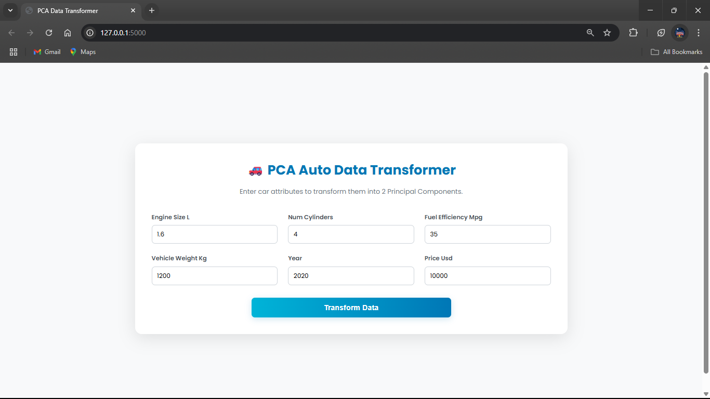
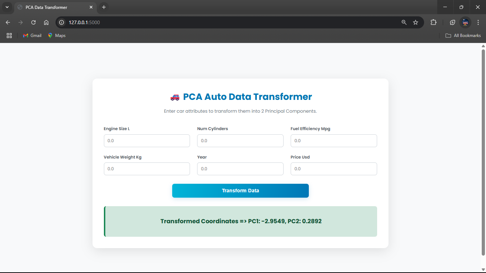

# Automated Data Preprocessing & PCA Transformer ⚙️

This project demonstrates how to build a reusable data preprocessing pipeline using **scikit-learn**. The pipeline automates the process of cleaning and transforming a raw dataset and then applies **Principal Component Analysis (PCA)** for dimensionality reduction.

The final output is a single `preprocessor.pkl` file that can be saved and loaded into other machine learning projects to consistently apply the same transformation steps to new data. This is a foundational technique in building robust and scalable machine learning systems.

-----

## 📄 Files Description

  * **`Auto Data Transformer.ipynb`**: This is the core Jupyter Notebook where the entire pipeline is designed and built. It includes:
      * Loading and inspecting the raw data.
      * Creating separate preprocessing steps for numerical and categorical features.
      * Combining these steps into a single `ColumnTransformer`.
      * Adding a PCA step to reduce the number of features.
      * Saving the final, complete pipeline object to a file.
  * **`preprocessor.pkl`**: The main output of this project. It is a serialized Python object containing the entire, fitted preprocessing and PCA pipeline. It's ready to be used to transform new data.
  * **`auto_data.csv`**: The sample dataset used within the notebook to build and demonstrate the transformation pipeline.

-----

## 🚀 How to Use This Project

This project is not a web app; it's a tool. The goal is to understand how the pipeline is built and then learn how to use the final `.pkl` file to transform data.

### Part A: Exploring the Notebook (How it was made)

Follow these steps to see how the preprocessing pipeline was constructed.

#### 1\. Get the Project Files

Download the project folder to your local machine.

```bash
# Use svn to export just this folder
svn export https://github.com/SURESH6161/Data-Science/trunk/Unsupervised/Auto_Data_PCA_Transformer

# Navigate into the new directory
cd Auto_Data_PCA_Transformer
```

*(Alternatively, you can download the repository as a ZIP from GitHub and navigate to this folder).*

#### 2\. Create a Virtual Environment

It's a good practice to keep project dependencies isolated.

```bash
# Create the environment
python -m venv venv

# Activate it
# On Windows:
venv\Scripts\activate

# On macOS/Linux:
source venv/bin/activate
```

#### 3\. Install Dependencies

Create a file named `requirements.txt` in the project directory with the following content:

**`requirements.txt`**:

```
scikit-learn
pandas
numpy
notebook
```

Now, install all the libraries with pip:

```bash
pip install -r requirements.txt
```

#### 4\. Launch Jupyter Notebook

Start Jupyter from your terminal (with the virtual environment active).

```bash
jupyter notebook
```

In the browser tab that opens, click on **`Auto Data Transformer.ipynb`** to view and run the code cells and understand how the pipeline was created and saved.

-----

### Part B: Using the Saved Pipeline (How to use it)

The real power of this project is in using the saved `preprocessor.pkl` file. Here is a simple example of how you would use it in a different Python script or project.

```python
import pandas as pd
import pickle

# 1. Load the saved preprocessor object
with open('preprocessor.pkl', 'rb') as f:
    preprocessor = pickle.load(f)

# 2. Load some new, raw data (we'll use the sample csv for demonstration)
# In a real project, this would be new, unseen data.
new_data = pd.read_csv('auto_data.csv')
# Let's just use the first 5 rows as an example of new data
new_data_sample = new_data.head()

print("Shape of original data:", new_data_sample.shape)
print("Original data:\n", new_data_sample)

# 3. Apply the loaded preprocessor to transform the new data
transformed_data = preprocessor.transform(new_data_sample)

print("\nShape after PCA transformation:", transformed_data.shape)
print("Transformed data (now reduced to principal components):\n", transformed_data)

```

This script shows how easily you can apply a complex series of transformations to new data with just one line of code: `preprocessor.transform(new_data_sample)`.

-----

## 🖼️ Screenshot




-----

## ⚖️ Disclaimer

This project is an educational demonstration of building a reusable data processing pipeline with scikit-learn and PCA. The specific steps and parameters are tailored to the sample `auto_data.csv` and would need to be adapted for different datasets.