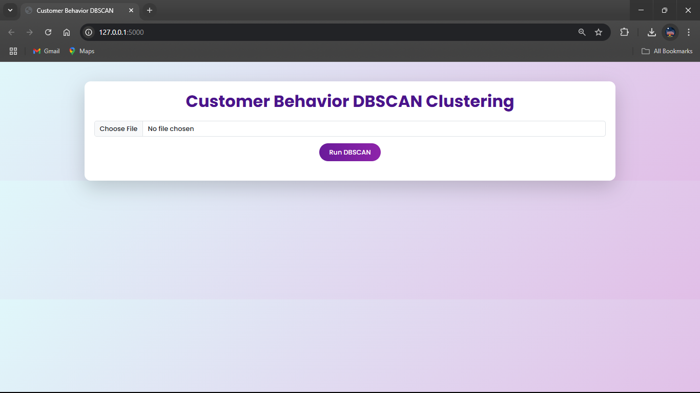
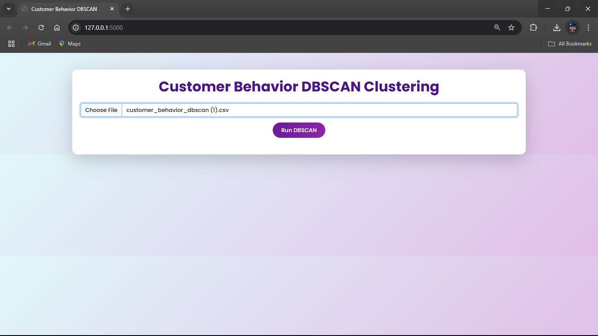
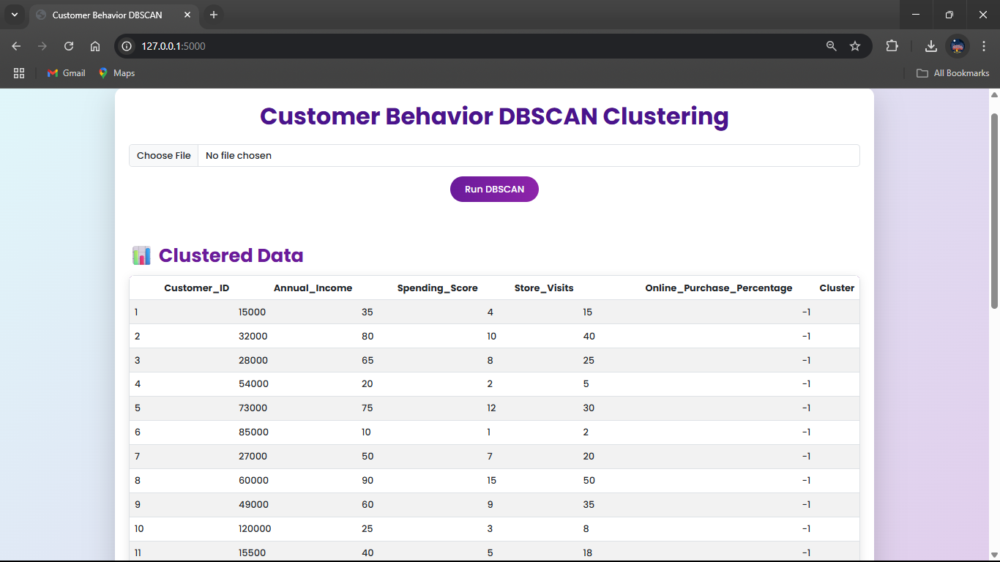

---

# Customer Behavior Clustering with DBSCAN

This project applies the **DBSCAN (Density-Based Spatial Clustering of Applications with Noise)** algorithm to group customers based on their behavior patterns.
It includes a **Flask web application** where you can upload datasets, run clustering, and visualize results interactively.

---

## 📂 Project Structure

```
Customer_Behavior_DBSCAN/
├── customer_behavior_dbscan.csv     # Sample dataset
├── app.py                           # Flask app entry point
├── create_classifier_model.py       # DBSCAN model training and clustering
├── requirements.txt                 # Python dependencies
│
├── templates/
│   └── index.html                   # Frontend HTML template
│
└── static/
    └── css/
        └── style.css                # Styling for the web app
```

---

## 🚀 Features

* Upload your own **CSV dataset** for clustering.
* Automatically detects numeric columns for DBSCAN.
* Visualizes results with **interactive scatter plots**.
* Clean, modern UI with responsive design.
* Supports any numeric dataset (customer data, market data, etc.).

---

## 🛠 Installation & Setup

### 1️⃣ Clone the repository

```bash
git clone https://github.com/your-username/Customer_Behavior_DBSCAN.git
cd Customer_Behavior_DBSCAN
```

### 2️⃣ Install dependencies

Make sure you have **Python 3.8+** installed.

```bash
pip install -r requirements.txt
```

### 3️⃣ Run the application

```bash
python app.py
```

The app will start at **`http://127.0.0.1:5000`**

---

## 📊 Example Dataset

The sample dataset `customer_behavior_dbscan.csv` contains features like:

* **Annual Income**
* **Spending Score**
* **Store Visits**
* **Online Purchase Percentage**

You can replace it with your own dataset — just ensure it’s a **CSV file** with numeric columns.

---

## ⚙ How It Works

1. **Upload a CSV file** from the web interface.
2. **Model Training:** DBSCAN groups data points based on density.
3. **Result Visualization:** A scatter plot displays the clusters.
4. **Noise Points:** DBSCAN marks outliers as `-1`.

---

## 📷 Screenshot





---

## 📌 Dependencies

* Flask
* pandas
* scikit-learn
* matplotlib
* seaborn

---

## 💡 Notes

* Works best when data is **scaled** before DBSCAN.
* Choose DBSCAN parameters (`eps`, `min_samples`) wisely to get meaningful clusters.
* You can tweak the parameters in `create_classifier_model.py`.

---
## ⚖️ Disclaimer

This project is an educational demonstration of applying the DBSCAN clustering algorithm to customer behavior data.  
The preprocessing steps, chosen features, and parameters (e.g., `eps`, `min_samples`) are tuned for the included sample dataset and may require adjustments for other datasets.  
It is intended for learning purposes and should be adapted, tested, and validated before any production or business use.

